<p align="center">
  
</p>

<p align="center">
  <a href="https://www.linkedin.com/in/luana-carvalho-de-almeida-134877234"></a>
  
  
</p>

<br>

```
$ whoami
```

Estudante de Engenharia de Software na UnB/FGA, atuando em três frentes ao mesmo tempo:
robótica aérea autônoma, pesquisa em sistemas espaciais e engenharia de dados.
Meta de longo prazo: software para sistemas aeroespaciais → pós em Sistemas
Embarcados na UFPE → Embraer.

<br>

```
$ ls -la current_roles/
```

| | | |
|---|---|---|
| 🚁 | **EDRA** | Equipe de Robótica Aérea da UnB — controle e software embarcado |
| 🛰️ | **LaSE** | Laboratório de Sistemas Espaciais (parceria AEB) — pesquisa aeroespacial |
| 📊 | **GovHub-br** | Engenharia de dados para transparência governamental |

<br>

---

### `$ cd projects/ && ls`

<details>
<summary>🚁 <b>edra/</b> — autonomia de VANTs para competições (CBR, SAE BRASIL)</summary>
<br>

Software de missão para drones autônomos, cobrindo detecção, decisão e execução:

- Detecção por visão computacional (**YOLO + OpenCV + PiCamera2**) com suavização temporal e thresholds de confiança em cascata
- Árvores de comportamento com **py_trees** integradas a **ROS2**
- Simulação em **PX4 + Gazebo Harmonic**, incluindo scripts de missão e controlador PD para manobras específicas
- Diagnóstico embarcado: comunicação Raspberry Pi ↔ estação em solo via HTTP

`stack:` ROS2 · PX4 · Gazebo · py_trees · YOLO · OpenCV · Docker

</details>

<details>
<summary>🛰️ <b>lase-microthrust-balance/</b> — bancada de medição de microempuxo</summary>
<br>

Arquitetura de software para bancada de testes de microempuxo, usada por pesquisadores
não necessariamente de software:

- Interface **Streamlit** com 3 módulos: calibração, aquisição e análise
- Processamento de sinal: **FFT, filtro Butterworth, Kalman + Digital Twin**
- Restrições reais de laboratório: operação offline, limite de segurança de 1000V, uso em máquina Windows compartilhada
- Apresentado na **XI ReLaCa ESPACIO** · artigo submetido ao **IAC 2026**

`stack:` Python · Streamlit · NumPy/SciPy

</details>

<details>
<summary>🌕 <b>exoterra/</b> — visualização 3D de ambientes lunares (PIBIC, a partir de ago/2026)</summary>
<br>

Pesquisa em visualização de terrenos lunares a partir de dados reais **LRO/NASA**,
parceria LaSE × COSMOS:

- Engine: **Godot Engine** com **GDExtension** em **C++**
- Importação de malhas via **glTF 2.0**
- Foco em representação fiel de topografia lunar para fins científicos

`stack:` C++ · Godot Engine · GDExtension · glTF 2.0

</details>

<details>
<summary>📊 <b>govhub-br/</b> — engenharia de dados para dados públicos</summary>
<br>

DAGs de ingestão de dados governamentais no **Apache Airflow**:

- Ingestão de dados do **SICONV** (download, parsing de CSV sem extração completa do zip)
- Validação explícita de schema por tabela
- Rastreamento de histórico de filiação partidária de deputados, para cruzamento com emendas orçamentárias
- Debugging de casos reais: BOM em CSVs do governo, `BadZipFile`, schemas divergentes

`stack:` Apache Airflow · PostgreSQL · Python

</details>

<br>

---

### `$ cat now.md`

```yaml
estudando:
  - ICP (Iterative Closest Point) para odometria com LiDAR
  - Arquitetura de software para sistemas aeroespaciais
  - Godot Engine + GDExtension para visualização científica
construindo:
  - PIBIC ExoTerra (LaSE × COSMOS)
  - Artigo IAC 2026 (bancada de microempuxo)
```

<br>

---

### `$ git log --graph --oneline`

<p align="center">
  <picture>
    <source media="(prefers-color-scheme: dark)" srcset="https://raw.githubusercontent.com/luanaa2005/luanaa2005/output/github-contribution-grid-snake-dark.svg"/>
    
  </picture>
</p>

<sub>⚙️ gerado automaticamente todo dia via GitHub Actions a partir do grid de contribuições real — veja `.github/workflows/snake.yml`</sub>

<br>

---

### `$ contact --reach`

<p align="center">
  <a href="https://www.linkedin.com/in/luana-carvalho-de-almeida-134877234"></a>
</p>

<p align="center">
  <sub>"building systems that go beyond the ground"</sub>
</p>